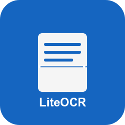

<div align="center">
  
</div>

<div align="center">
  <a href="README.md">English</a> |
  <a href="README_zh.md">中文</a>
</div>

# LiteOCR - AI-Powered OCR Tool

This is an AI-powered OCR tool. You can use hotkeys to capture screen content, then send it to large language models for processing, automatically converting it into Markdown format. The processed result will be automatically copied to the clipboard, making it convenient for you to directly paste where needed.
## ✨ Features

- **Quick Screenshot**: Use changeable hotkeys to quickly capture screen areas, send them to large language models, and convert them into Markdown format.
- **System Tray Management**: Convenient system tray icon management.
- **Support for multiple model providers**: OpenAI, OpenAI compatible, Google AI Studio (Gemini), Ollama.

## 🚀 Installation and Running

### Install Dependencies

```bash
# Install dependencies using pip
pip install -e .
# or
# Install dependencies using uv
uv sync
```

### Run the Program

If you don't want to run the program from source, you can directly download the executable file.

Go to the [Releases](https://github.com/zwldarren/LiteOCR/releases) page to download the latest executable file, then double-click to run `liteocr.exe`.

### Run from Source

```bash
# Generate resource files using PySide6
uv run pyside6-rcc resources/resources.qrc -o src/liteocr/resources_rc.py

# Run the program
uv run liteocr
```

## 🛠️ How to Use

1. After running the program, an icon will appear in the system tray.
2. Right-click the icon to see menu options:
   - "Settings": Configure API key and model name.
   - "Exit": Exit the program.
3. Use the hotkey `Ctrl+Alt+S` to select a screen area.
4. The program will automatically process the screenshot and perform the conversion. The result will be automatically copied to the clipboard.

## 📄 License

[MIT License](LICENSE)
