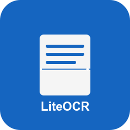

<div align="center">
  
</div>

<div align="center">
  <a href="README.md">English</a> |
  <a href="README_zh.md">中文</a>
</div>

# LiteOCR - Quick Screenshot OCR Tool

A lightweight OCR tool that uses large language models to convert screenshot text into Markdown format and copies it to the clipboard.

> **Note**: The project is still in the early stages of development. The current version is a prototype and may have bugs. Please report any issues you encounter.

## ✨ Features

- **Quick Screenshot**: Use the hotkey (Ctrl+Alt+S) to quickly capture a screen area.
- **Intelligent Recognition**: Automatically recognizes mathematical formulas, tables, and text formatting.
- **Format Conversion**: Converts to structured Markdown/LaTeX format.
- **Auto Copy**: Results are automatically copied to the clipboard.
- **System Tray Management**: Convenient system tray icon for management.

## 🚀 Installation and Usage

### Installation

```bash
uv sync
```

### Running the Program

```bash
uv run liteocr
```

## 🛠️ How to Use

1. After running the program, an icon will appear in the system tray.
2. Right-click the icon to see menu options:
   - "Settings": Configure API key and model name.
   - "Exit": Exit the program.
3. Use the hotkey `Ctrl+Alt+S` to select a screen area.
4. The program will automatically process the screenshot and perform the conversion. The result will be automatically copied to the clipboard.

## 📄 License

[MIT License](LICENSE)
