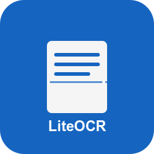

<div align="center">
  
</div>

<div align="center">
  <a href="README.md">English</a> |
  <a href="README_zh.md">中文</a>
</div>

# LiteOCR - 快速截图 OCR 工具

一款 OCR 工具，使用大型语言模型将截图文本转换为 Markdown 格式并复制到剪贴板。

> **注意**: 项目仍处于早期开发阶段，目前版本可能存在一些 bug。如遇到问题，请反馈。

## ✨ 功能特性

- **快速截图**: 使用快捷键 (Ctrl+Alt+S) 快速捕捉屏幕区域。
- **智能识别**: 自动识别数学公式、表格和文本格式。
- **格式转换**: 转换为结构化的 Markdown/LaTeX 格式。
- **自动复制**: 结果自动复制到剪贴板。
- **系统托盘管理**: 便捷的系统托盘图标管理。

## 🚀 安装与运行

### 安装

```bash
uv sync
```

### 运行程序

```bash
uv run liteocr
```

## 🛠️ 使用方法

1. 运行程序后，系统托盘区将出现一个图标。
2. 右键点击图标查看菜单选项：
   - "设置 (Settings)": 配置 API 密钥和模型名称。
   - "退出 (Exit)": 退出程序。
3. 使用快捷键 `Ctrl+Alt+S` 选择屏幕区域。
4. 程序将自动处理截图并进行转换，结果会自动复制到剪贴板。

## 📄 许可证 (License)

[MIT 许可证 (MIT License)](LICENSE)
